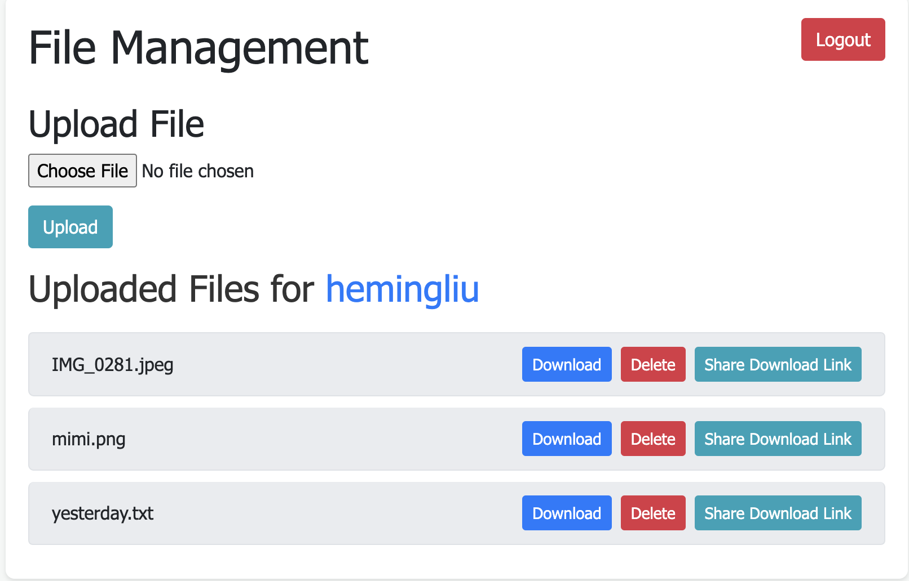

# PixelShare

PixelShare is a Rust-based web application I designed for sharing and managing files. It leverages modern web technologies and Rust for file management and file sharing.

## Screenshots

### Homepage

## Features

- **User Authentication**: Secure signup and login functionality.
- **File Upload and Download**: Users can upload and download their images.
- **File Management**: Users can view, delete, and share links to their uploaded images.
- **Responsive UI**: A frontend designed with Bootstrap for a responsive user experience.

## Technologies Used

- **Backend**: Rust with Warp for the web server, SQLx for database interactions, and Tokio as the asynchronous runtime.
- **Frontend**: HTML, CSS (Bootstrap), and JavaScript for dynamic content.
- **Database**: SQLite for storing user and file information.
- **Authentication**: JSON Web Tokens (JWT) for secure user authentication.

## Getting Started

### Prerequisites

- Rust and Cargo (Rust's package manager)
- SQLite (for the database)

### Installation

1. Clone the repository:

git clone https://github.com/heming277/pixelshare.git

cd pixelshare

2. Set up the environment variables by creating a `.env` file in the root directory with the following content:

DATABASE_URL=sqlite:mydb.sqlite
SECRET_KEY=your_secret_key

Generate a `SECRET_KEY` using the command: `openssl rand -base64 32`

3. Build and run the application:

cargo run

The server will start, access the web application at `http://localhost:3030`.

## Optional: Running with Docker

### Building the Docker Image

First, ensure Docker is installed. Then, run in root directory:

docker build -t pixelshare .

This command builds a Docker image named `pixelshare` based on the instructions in the `Dockerfile`.

### Running the Application in a Docker Container

After building the image, run the application in a Docker container using the following command:

docker run -p 3030:3030 pixelshare

## Usage

- Visit `http://localhost:3030` in the web browser.
- Sign up for an account or log in.
- Start uploading, downloading, and managing various files.

## Future developments

- Image Processing: Implement features for image conversion, resizing, and applying filters.
- Main Feature: Collaborative Editing with Group Files.

## Contributing

Contributions are welcome! Please feel free to submit a pull request.

## License

This project is licensed under the MIT License - see the [LICENSE](LICENSE) file for details.
